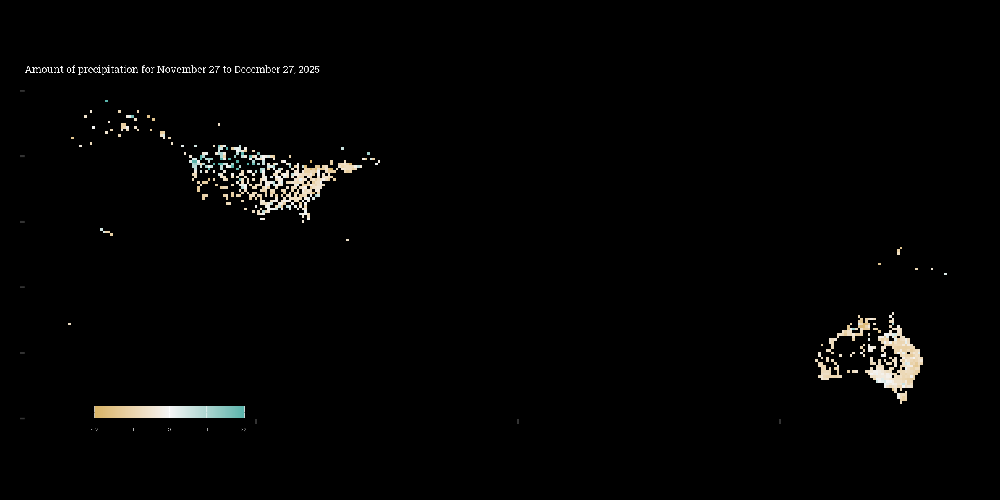

```{r echo = FALSE, message = FALSE}
library(lubridate)
```

```{css echo = FALSE}
.author, .title = {
    display; none;
}

.main-container{
    max-depth: 100%;
}

body {
    background-color: black;
    color: #f5f5f5;
    font-size: 1.2vw;
    font-family; "Montserrat", sans-serif;
}
```


Last update on `r today()`  
Site [developed](`r rmarkdown::metadata$github_repo`) by Salam